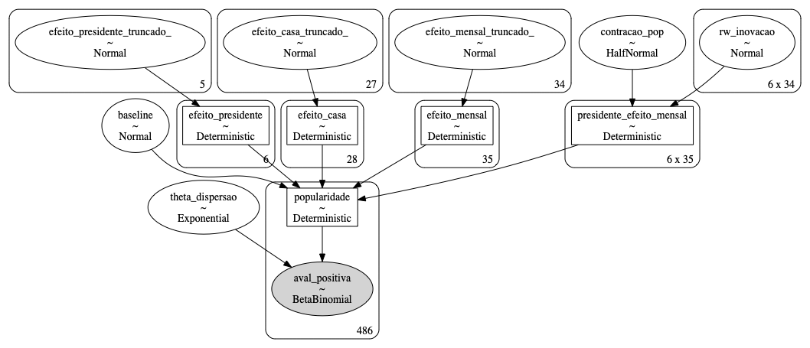

Polling the polls
=============================================================================================================

## This project has two goals: 
> Forecasting elections with Bayesian inference models
> Tracking polling data to estimate the Brazilian presidents' latent popularity over time:
  - [Interactive dashboard](https://www.jota.info/popularidade)

## What is it?
This repository is a collection of models written in Python (PyMC3), R, Stan, Jags or Bugs, and dashboards for displaying the results. For now, the models are focused on forecasting the next Brazilian elections.
 
 

